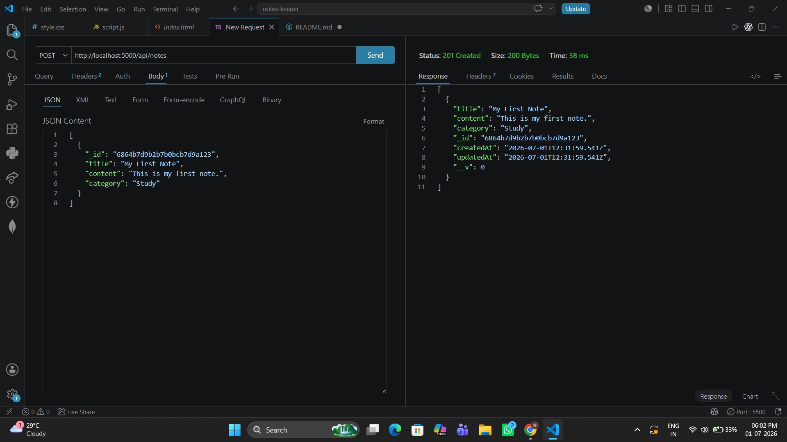
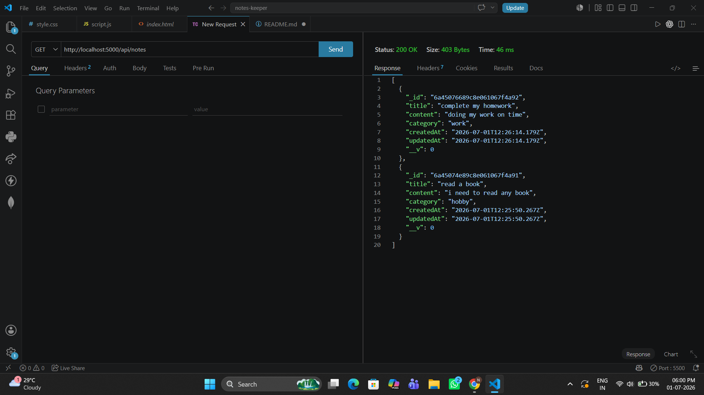
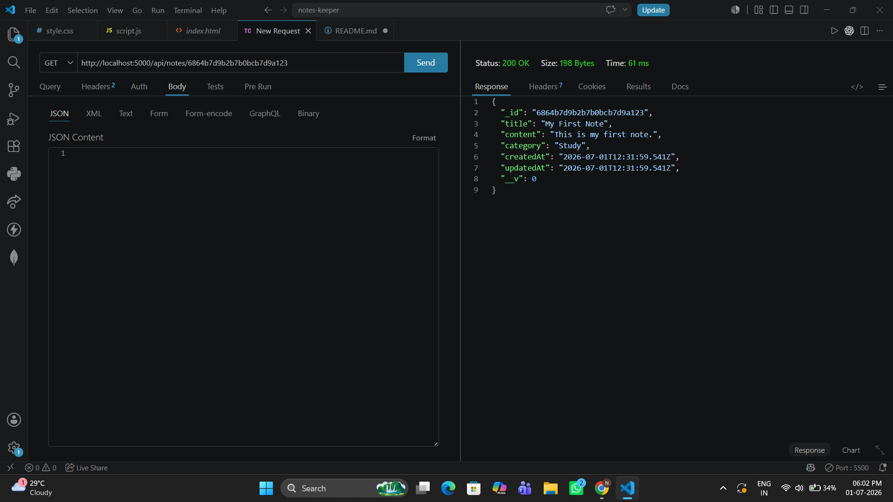
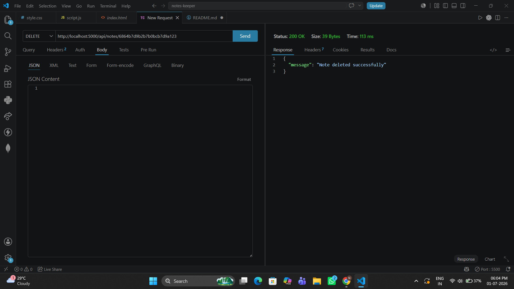

# Notes Keeper

A full-stack Notes Keeper application built using Node.js, Express.js, MongoDB Atlas, and JavaScript. The application allows users to create, view, update, and delete notes using RESTful APIs.

## Features

- Create Notes
- View Notes
- Update Notes
- Delete Notes
- Responsive Frontend
- MongoDB Atlas Database
- RESTful API
- Thunder Client API Testing

## Tech Stack

Frontend
- HTML
- CSS
- JavaScript

Backend
- Node.js
- Express.js

Database
- MongoDB Atlas
- Mongoose

Tools
- Thunder Client
- Git
- GitHub

## API Endpoints

POST   /api/notes

GET    /api/notes

GET    /api/notes/:id

PUT    /api/notes/:id

DELETE /api/notes/:id

## Installation

npm install
npm run dev
